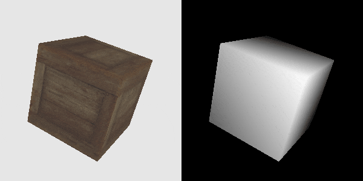
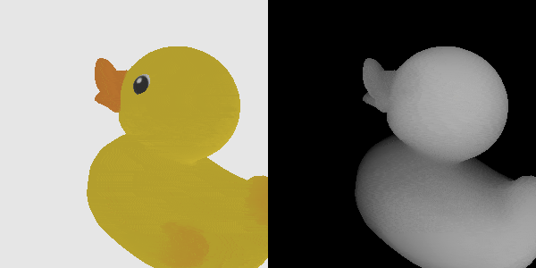
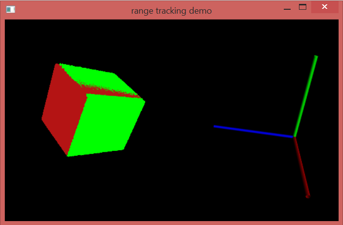
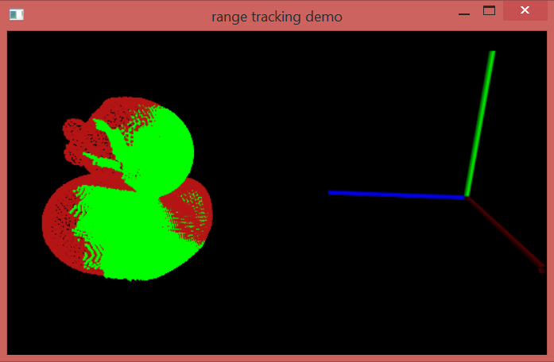

# Goal 

The goal of this project is to get an algorithm that can track known rigid objects in a sequence of RGBD (color+depth) images. 

# Method

The rigid object is provided as a three dimensional triangulated surface using two wavefron OBJ files: one *obj* file with texture coordinates, and another obj file that may not have texture coordinate but has a densier set of vertices (it can be obtained using Meshlab).

In order to generate synthetic RGBD data, we render the textured model in various poses using OpenGL. Using OpenGL, we also generate an array that contains the xyz coordinate of the point projecting on each pixel in the camera 3D coordinate system and we generate point clouds in both the Point Cloud Library format and the ptx format (that can be opened in MeshLab).

We then track the rigid object in the sequence of generated point clouds using the Point Cloud Library. We find the pose in the first point cloud of the sequence using the *SampleConsensusInitialAlignment* with *FPFHSignature33* Features.
Assuming the deplacement of the object to be small between each sucessive frame, we use the Iterative Closest Point method to refine the pose in each frame using the pose in the previous frame as initialization. We could use dynamic model to predict the pose from previous frames but this is beyong the scope of this project.

# Compiling the code

* Install the all-in-one installer for the point cloud library version 1.8.1.
* Install cmake (assuming you are in windows)
* Use cmake-gui and *surfacematching\pcl\CMakeLists.txt* to generate the visual studio project in the *surfacematching\pcl\build64* folder
* Compile and add OpenNI2.dll (from *C:\Program Files\OpenNI2* added by the PCL installer) to the folder containing the executable i.e. *pcl\build64\Release*

# Running the code

**Note that this has only been tested on windows**.

You need first to install the python dependencies to generate the synthetic test dataset (see instruction below).
You need to install the Point CLoud Library in order to compile the C++ tracking code.

## Generating RGBD testing images

In order to generate the RGBD test sequences, you simply run the *RGBDSequenceGeneration.py* script in python 

	python RGBDSequenceGeneration.py

This will use OpenGL to generate a set of images and point clouds in both the pcd format and ptx formats in the *sequence\crate* subfolder. You can open the ptx files in MeshLab to visualize the synthetized data. In order to ease visualization of the generated data, an animated gif image is also created.

 
Some alternative methods to generate synthetic data could be to use:

 * the PCL method [pcl::RangeImage.createFromPointCloud](http://pointclouds.org/documentation/tutorials/range_image_creation.php). But it would require to generqte a very dense sampling of th esurface first.
 *  the PCL's *pcl\_virtual\_scanner\_release.exe* executable with code [here](https://github.com/PointCloudLibrary/pcl/blob/master/tools/virtual_scanner.cpp).  It uses VTK's *vtkCellLocator* function to performe ray / mesh intersections.
 * [render kinect](https://github.com/jbohg/render_kinect). The compilation tested on unbuntu only. It depends on CGAL, OpenCV and some other libraries.
 * [blensor](http://www.blensor.org/). It can only be run from within blender, which is not very convenient.
 * [CGAL](https://www.cgal.org/) ray/surface intersection methods

## Running the tracking

Once the test data has been generated, you can run the tracker on the crate sequence using

	runTrackingPCL_Crate.bat

Similarly, you can run the tracker on the duck sequence using
	
	runTrackingPCL_Duck.bat

Each of these two batch files will call the executable surfaceAlign with the right set of parameters.
This will run the executable and open a PCL viewer. You need to press *space* to step from on frame to another. You can use the mouse the turn around the point clouds.

We get the following result on the first frame of each sequence:

We find the pose in the first point cloud using functions from the  point cloud library. We use the *SampleConsensusInitialAlignment* method with  *FPFHSignature33* Features.
Assuming that the object has a only a small deplacement between each sucessive frame, we use the Iterative Closest Point method to refine the pose in each frame using the pose estimated in the previous frame as initialization. We could use a linear dynamic model to predict the pose from previous frames but this is beyong the scope of this project.

An alternative method could be to use the *surface_matching* OpenCV contribution available in OpenCV 3.4 described [here](https://docs.opencv.org/3.0-beta/modules/surface_matching/doc/surface_matching.html) inspired from [1], with a Python example available [here](https://github.com/opencv/opencv_contrib/tree/master/modules/surface_matching/samples)
In order to get that example running you will need to install the OpenCV Python bindings with the contributions. This method uses [point pair features](https://docs.opencv.org/3.1.0/dc/d9b/classcv_1_1ppf__match__3d_1_1ICP.html). 

Our method does not use the color information. We could use the method described in [2] to take advantage of the color. 

## Possible improvements

We do not use the information provided in the RGB image. We could extend our method by detecting interest points in the RGB image.

We convert the model into a point cloud using only the vertices in the OBJ file that contains the densified model. We could keep the triangles information to get a more accurate estimate of the normals and use a point to plan distance in the Iterative Closests Point method.
 

# Installing python Dependencies 

### ModernGL

The synthetic test data is generated using [ModernGL](https://github.com/cprogrammer1994/ModernGL), an easy to use Python OpenGL interface. This allows us to generate texture images and depth range images.
The installation is easily done in the command line by typing

		pip install ModernGL
		pip install ModerGl.ext.obj
		
In order for the import in python to work, you may need to go in your *\Lib\site-packages* subfolder in your python distribution and rename the lower case *moderngl* folder into *ModernGL* 
Instead of using *ModernGL* we could use *[PyOpenGL](http://pyopengl.sourceforge.net/)*, which follows closely the C interface, or [meshrenderer](https://github.com/BerkeleyAutomation/meshrender) which is build on top of *PyOpenGL* and is designed to make it easy to render images of 3D scenes in pure Python.		

### Pyrr

this is used by ModernGL. install it using 

		pip install pyrr

# Other ressources

* [python-pcl](https://github.com/strawlab/python-pcl) python binding to a small subset of the point cloud library. Looks like some features have been removed (some exmaple do not work anymore, for example *examples\official\Registration\alignment_prerejective.py*). Maybe because it is difficult to keep up with the PCL changes ?
* [MeshLabXml](https://github.com/3DLIRIOUS/MeshLabXML) is a Python (2.7 or 3) scripting interface to MeshLab, the open source system for processing and editing 3D triangular meshes. We could use the *mlx.remesh.uniform_resampling* method to resample the model and get a dense set of points.

### References

[1] *3d object detection and localization using multimodal point pair
  features.* B. Drost and S. Ilic. 2012 Second International Conference on 3D Imaging, Modeling,
  Processing, Visualization Transmission Oct 2012.

[2] *Colored point cloud registration revisited* J. Park, Q.Y. Zhou, and V. Koltun. IEEE International Conference on Computer Vision. Oct 2017.
